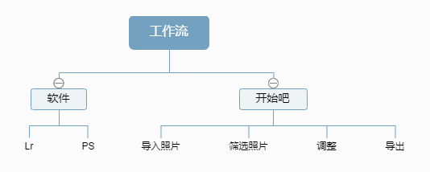

# Lightroom 101
## **Why**
网上教程那么多为什么我又要写一遍呢？

 **因为我想写**,自己也用Lr和Ps这么多年了，算是有点心得体会，写出来做个简单易懂的教程

## 看点工作流

软件就是Lr和Ps,因为这是个Lr工作流的文，所以Ps只会讲讲基本的用途。
> 注意Lr分成了Lightroom和**Lightroom classic**，这里的Lr指代的是**Lightroom classic**版本

> 本文基于Windows版本，Mac OS版本同理，大部分快捷键只是Ctrl/Cmd的区别，若有不同请参考[Adobe Shortcuts](https://helpx.adobe.com/lightroom-classic/help/keyboard-shortcuts.html)
---

## 准备工作
>仅供参考，如果有自己的想法那就是你对

在打开软件之前，需要提前做一些准备工作，规范工作流程，以免造成如下问题：
- 我的相机拍摄的照片在哪
- 我在不知道照片在哪
- 我输出的文件在哪
- 。。。。

工作流是基于项目的，每个项目都有不同的物料，所以进入软件之前就是将项目所在位置规划好并导入素材
1. 先在电脑上选一个心知肚明并且**空间足够**的地方，新建一个文件夹，文件夹命名我习惯使用`YYYYMM_ProjectName`的方式，比如在20年6月在厦门拍摄的一组照片我会将项目文件名命名成`202006_Xiamen`。
这次的项目名称叫做`Lightroom101`，所以在本地磁盘内建立的文件夹名称就为`202109_Lightroom101`
2. 将这次项目需要处理的所有照片**复制**到电脑的磁盘中的刚建立好的项目文件夹下
3. 打开Lr软件，选择`File`->`New Catalog`新建项目目录，位置就选择在刚刚建立的项目文件夹下。文件名我的习惯是采用`ProjectName`，输入`Lightroom101`之后就建立了Lr的Catalog文件

>Lr其实内置了复制工具，有兴趣可以研究一下 [Import photos from a camera or card reader](https://helpx.adobe.com/lightroom-classic/help/importing-photos-lightroom-basic-workflow.html)

>**！不要直接从储存卡导入软件！****！不要直接从储存卡导入软件！****！不要直接从储存卡导入软件！** 储存卡（特别是SD卡）是非常脆弱的储存介质，复制到电脑磁盘上保证工作的稳定。

>最好使用**英文目录**避免奇怪的问题

---

## 认识Lr
虽然不是很想写这部分，这些上网就能查找到，但是~~作为一个负责的101作者~~简单介绍一下界面免得第一次打开面对软件茫然
>详细了解各个工作区布局的可以查看[Adobe官方文档](https://helpx.adobe.com/lightroom-classic/help/workspace-basics.html)

